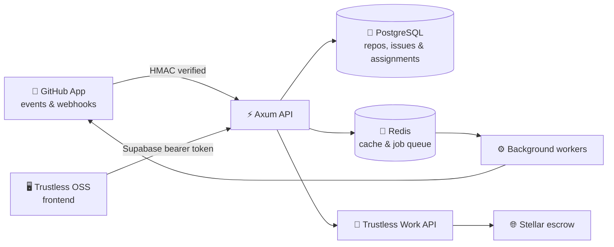

<div align="center">


[](https://github.com/Trustless-OSS/Toss-Backend/actions/workflows/rust.yml)


[Overview](#-overview) • [How it works](#-how-it-works) • [Quick start](#-quick-start) • [API map](#-api-map) • [Development](#-development)

</div>

---

## 🌟 Overview

Toss Backend is the orchestration layer for the Trustless OSS platform. It
connects GitHub activity with bounty state, contributor wallets, and escrow
operations while keeping slow or retryable work in background jobs.

| Capability | What it handles |
| --- | --- |
| 🐙 **GitHub integration** | GitHub App installations, repository sync, signed webhooks, issues, assignments, labels, and pull requests |
| 🎯 **Bounty lifecycle** | Reward tiers, contributor assignment, milestone creation, retries, and payout status |
| 🔐 **Authentication** | Supabase bearer-token verification with GitHub identity extraction |
| 💸 **Escrow operations** | Unsigned transaction creation, deployment, funding, refunds, closure, and submission through Trustless Work |
| ⚙️ **Background processing** | Redis-backed webhook jobs, scheduled work, retries, and queue statistics |
| 🩺 **Operations** | PostgreSQL migrations, dependency-aware health checks, request tracing, and graceful shutdown |

## 🔄 How it works



The common bounty journey is:

1. A maintainer connects a repository and configures reward tiers.
2. GitHub sends signed issue, assignment, label, and pull-request events.
3. The backend records bounty state and processes retryable work through Redis.
4. A contributor connects a payout wallet and the milestone is pushed to escrow.
5. Completion events move the bounty toward release and update its payout state.

## 🧰 Tech stack

| Layer | Technology |
| --- | --- |
| API | Rust 2021, Axum 0.8, Tokio |
| Data | PostgreSQL, SQLx, Diesel ORM 2.2, Redis |
| Authentication | Supabase Auth, GitHub identity |
| Integrations | GitHub App API, Trustless Work, Stellar |
| Observability | `tracing`, dependency-aware health checks |
| Local infrastructure | Docker Compose |

## 🚀 Quick start

### Prerequisites

- [Rust](https://www.rust-lang.org/tools/install) stable toolchain
- [Docker](https://docs.docker.com/get-docker/) with Docker Compose
- GitHub App, Supabase, Stellar, and Trustless Work credentials for the
  integration flows you want to exercise

### 1. Configure the environment

```bash
cp .env.example .env
```

Open `.env` and replace the placeholder credentials. The application validates
its required configuration at startup, so all required values must be present.
Never commit the populated `.env` file.

### 2. Start PostgreSQL and Redis

```bash
docker compose up -d
docker compose ps
```

This starts PostgreSQL at `localhost:5435` and Redis at `localhost:6379`.

### 3. Run the API

```bash
cargo run
```

The server starts at `http://localhost:5000` by default. Database migrations
run automatically during startup.

### 4. Verify the service

```bash
curl http://localhost:5000/
curl http://localhost:5000/api/health
```

The root endpoint confirms that the API is running. The detailed health endpoint
also reports PostgreSQL, Redis, environment, and Trustless Work status.

> [!TIP]
> If port `5000` is already in use, change `PORT` in `.env` and use the same
> port in your health-check URL.

## 🔑 Environment guide

The complete template lives in [`.env.example`](.env.example).

| Group | Variables | Purpose |
| --- | --- | --- |
| Runtime | `NODE_ENV`, `PORT`, `LOG_LEVEL` | Server mode, address, and logging |
| Infrastructure | `DATABASE_URL`, `REDIS_URL` | PostgreSQL, cache, and job queue |
| Authentication | `SUPABASE_URL`, `SUPABASE_PUBLISHABLE_KEY` | Bearer-token verification |
| GitHub | `GITHUB_APP_ID`, `GITHUB_APP_PRIVATE_KEY`, `GITHUB_WEBHOOK_SECRET` | App authentication and webhook verification |
| Stellar | `STELLAR_NETWORK`, platform and dispute-resolver keypairs | Transaction signing and network selection |
| Trustless Work | `TRUSTLESS_WORK_API_KEY`, `TRUSTLESS_WORK_BASE_URL` | Escrow API access |
| Application | `APP_URL`, `WEBHOOK_URL` | Frontend and public webhook locations |
| Local webhook relay | `DEV_WEBHOOK_PROXY_ENABLED`, `SMEE_SOURCE_URL`, `SMEE_TARGET_URL` | Optional development-only GitHub relay |

`GITHUB_BOT_TOKEN` is optional and is only needed by paths that fetch GitHub
issue state directly.

## 🗺️ API map

Protected application routes use `Authorization: Bearer <supabase-access-token>`.
GitHub webhooks instead require a valid `X-Hub-Signature-256` signature.

| Area | Main endpoints |
| --- | --- |
| System | `GET /`, `GET /health`, `GET /api/health`, `GET /api/queue/stats` |
| Repositories | `GET /api/repos`, `POST /api/repos/connect`, `POST /api/repos/sync-installation`, `GET/DELETE /api/repos/{repoId}` |
| Issues and rewards | `GET /api/repos/{repoId}/issues`, `PUT /api/repos/{repoId}/rewards`, `POST /api/issues/{issueId}/retry` |
| Contributors | `POST /api/wallet/connect`, `GET /api/contributor/me` |
| Milestones | `POST /api/milestones/push` |
| Escrow | `POST /api/escrow/create-unsigned`, `/submit-deploy`, `/fund-unsigned`, `/submit-fund`, `/refund`, `/close-unsigned`, `/submit-close` |
| GitHub | `POST /api/webhooks/github` |

## 🗂️ Project structure

```text
Toss-Backend/
├── src/
│   ├── modules/        # Repo, GitHub, bounty, contributor, and escrow domains
│   ├── infra/          # PostgreSQL, Redis, queue, cache, and Stellar adapters
│   ├── middleware/     # Authentication and request middleware
│   ├── routes/         # Health and operational routes
│   ├── config.rs       # Environment configuration
│   ├── app.rs          # Axum router assembly
│   └── main.rs         # Startup and graceful shutdown
├── migrations/         # SQLx database migrations
├── docker-compose.yml  # Local PostgreSQL and Redis
└── .env.example        # Safe configuration template
```

## 🛠️ Development

Run the same core checks used by the project before opening a pull request:

```bash
cargo fmt --check
cargo build
cargo test
```

Useful local commands:

```bash
# Follow service logs
docker compose logs -f postgres redis

# Stop local infrastructure
docker compose down

# Stop it and remove local database/cache volumes
docker compose down -v
```

> [!WARNING]
> `docker compose down -v` deletes the local PostgreSQL and Redis volumes. Use
> it only when you intentionally want a clean local data reset.

## 🤝 Contributing

Issues and pull requests are welcome. Before submitting a change:

1. Keep changes focused on one concern.
2. Add or update tests for changed behavior.
3. Run the formatting, build, and test commands above.
4. Explain any configuration or migration changes in the pull request.

Have an idea or found a bug? [Open an issue](https://github.com/Trustless-OSS/Toss-Backend/issues).

---

<div align="center">

Built for open-source contributors by **Trustless OSS**.

</div>
